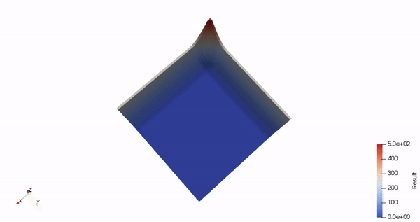

# rs_isl

[](https://crates.io/crates/rs_isl)
[](https://docs.rs/rs_isl)
[](https://crates.io/crates/rs_isl)
[](https://crates.io/crates/rs_isl)
[](https://github.com/KonradKaralus/rs_isl/actions)

rs_isl is an implementation of Iterative Stencil Loops in Rust.
ISLs can be used in a variety of scenarios such as image processing, fluid simulation and the calculation of PDEs.
For more information see [Wikipedia](https://wikipedia.org/wiki/Iterative_Stencil_Loops).

## Example

This animation was created with [Paraview](https://www.paraview.org/) from the data created by the example [two_waves](examples/two_waves.rs).

<p align="center">
  
</p>

## Output

rs_isl writes [.vtk](https://vtk.org/) output files to a specified path. Their contents may be defined by the user.

To create those files rs_isl uses the [vtkio](https://github.com/elrnv/vtkio) crate.

## Usage

### General

```rust
use core::f64;
use std::{cmp::max, path::PathBuf};
use rs_isl::*;

fn main() {
    // create a domain with a size of 200 by 100
    let dim = (200, 100)
    // we only access the left neighbour of every cell
    let neighbours = vec![(-1, 0)];
    // take neighbours value, if there is no neighbour decrease by 3
    let op = |num: &f32, nb: Vec<Option<&f32>>| {
        if nb.first().unwrap().is_some() {
            let f = *nb[0].unwrap();
            return f;
        }
        return max(*num as i32 - 3, 0) as f32;
    };
    // creates a sine shape at the left boundary of the domain
    let init = |x: usize, _y: usize| {
        if x < DIM.0 / 10 {
            let fac = x as f64 / (DIM.0 / 10) as f64 * f64::consts::FRAC_PI_2;
            return (250.0 - 250.0 * fac.sin()) as f32;
        }
        0.0
    };
    // create the simulation parameters
    let params = IslParams::new(
        dim,
        op,
        // number of threads for simulation, the domain size must be divisible by this number
        10,
        init,
        // number of simulation steps
        200,
        // number of output steps
        100,
        neighbours,
        // path for writing vtk files
        PathBuf::from("raw"),
    );
    // run the simulation
    run_isl(params).unwrap();
}
```

### Setting output values for a custom data type

```rust
struct Point {
    x: u32,
    y: u32,
}

impl VtkOutput for Point {
    fn value_names() -> Vec<String> {
        // define the names of the DataArrays
        vec!["x_coord".into(), "y_coord".into()]
    }
    fn cellvalue(&self) -> Vec<f32> {
        // write the values for every cell
        vec![self.x as f32, self.y as f32]
    }
}
```