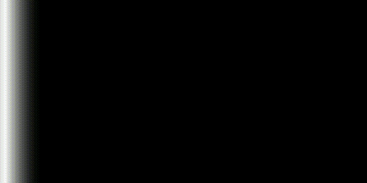

# rs_isl

[](https://crates.io/crates/rs_isl)
[](https://docs.rs/rs_isl)
[](https://crates.io/crates/rs_isl)
[](https://crates.io/crates/rs_isl)
[](https://github.com/KonradKaralus/rs_isl/actions)

rs_isl is an implementation of Iterative Stencil Loops in Rust.
ISLs can be used in a variety of scenarios such as image processing, fluid simulation and the calculation of PDEs.
For more information see [Wikipedia](https://wikipedia.org/wiki/Iterative_Stencil_Loops).

## Example

This animation was created with the [rs_isl Visualizer](https://github.com/KonradKaralus/rs_isl-Visualizer) from the data created by the example [left_to_right_wave](examples/left_to_right_wave.rs).

<p align="center">
  
</p>

## Usage

```rust
use rs_isl::{run_isl, IslParams};

// grid with a size of 4x2, where cells only access their left neighbour
let size = (4, 2);
let neighbours = vec![(-1, 0)];

// closure that calculates the new value based on the cell's own value and it's neighbours
let op = |_num: &f64, nb: Vec<Option<&f64>>| {
    if nb.first().unwrap().is_some() {
        let f = nb[0].unwrap();
        // if the cell's neighbour has the value 1.0, we take that, otherwise we return 0.0
        if *f != 0.0 {
            return 1.0;
        }
    }
    0.0
};
// closure that determines each cell's initial value based on it's position
let init = |x: usize, _y: usize| {
    // return 1.0 if the cell is located on the left boundary of the grid
    if x == 0 {
        return 1.0;
    }
    0.0
};

// create parameters
let params = IslParams::new(
    size,
    op,
    // number of threads, the grids size (x*y) must be divisible by this value
    1,
    init,
    // number of steps for which the simulation will be run
    4,
    // number of output steps, these will be evenly distributed through the simulation
    4,
    neighbours,
    // type of returned data
    rs_isl::OutputType::String,
);

// run ISL
let data = run_isl(params);

// extract the data
match data.unwrap() {
    rs_isl::IslOutput::RawData(vec) => println!("{:?}", vec),
    rs_isl::IslOutput::String(vec) => {
        for line in vec {
            println!("{}", line)
        }
    }
}
```
